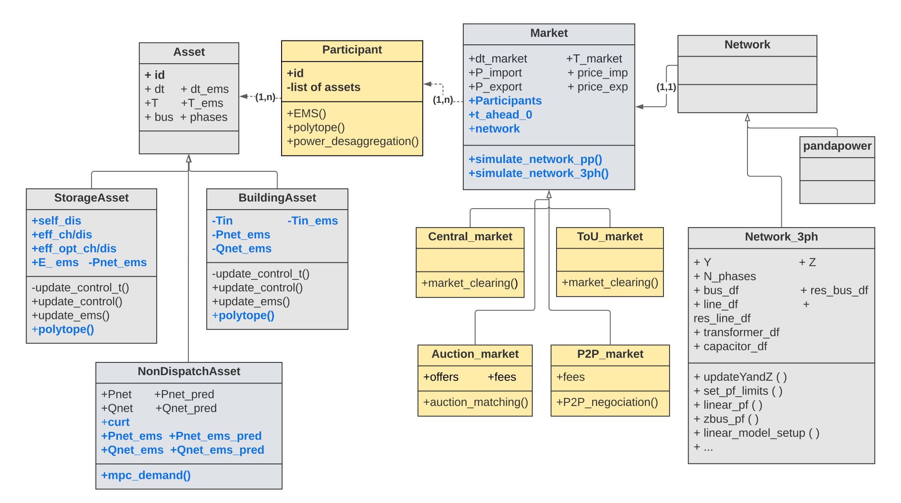
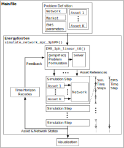

Overview
=============

Energy System Architecture Lab ESAL's OPLEM is a tool for modelling and testing LEM designs. The platform combines distributed energy resource modelling (e.g. for PV generation sources, battery energy storage systems, electric vehicles), power flow simulation, multi-period optimisation for scheduling flexible energy resources, and offers a modular and flexible framework to create and test market designs adapted for distribution networks. OPLEM comes with the same features as `OPEN <https://github.com/EPGOxford/OPEN>`_, which all combined cannot be found in existing tools, such as the multi-phase distribution network power flow, non-linear energy storage modelling, receding horizon and multi-period optimisation, separate models for control and simulation and the additional key feature of a generic market modelling that incorporates the common LEM designs and allows the user to develop their customised LEM designs.

The key features of OPLEM are presented in: (Insert paper info here when ready)

Installation
-------------
#. Create a conda virtual environment: ``conda create --name <name_env> python``

#. and activate it: ``conda activate <name_env>``

#. install oplem package and its dependencies by running the following: ``pip install git+https://github.com/EsaLaboratory/OPLEM.git``

#. Optimisation algorithms use ``mosek`` solver, academic license can be requested from `their website <https://www.mosek.com/products/academic-licenses/>`_

Getting started
----------------

The simplest way to start is to run the notebook ``ToU_simple.ipynb`` that demonstrates a simple case study.

More advanced case studies can be found under the root directory of the repo:

- test_TOU_Market.py

- test_P2P_Market.py

- test_Central_Market.py

Platform Structure
--------------------

OPLEM is implemented in Python using an object orientated programming approach, with the aim of providing modularity, code reuse and extensibility.
Fig. 1 shows a universal modelling language (UML) class diagram of OPLEM with the added features highlighted in different colours. OPLEM has four important base classes: Asset, Network, Market and Participant.

*Note: the ``EnergySystem`` class was removed and its main methods were moved now to the ``Market`` class

* Simulation methods can be found under ``Market.simulate_network_xx()``

* Central optimisation methods can be found in the inhereted subclass ``Central_Market.market_clearing()``. The copper plate option can be passed through ``nw_cont=False`` to the ``market_clearing()`` method and the one with linear multi-phase distribution network model through ``nw_const=True`` (set by default)

* Open loop and model predictive control simulations can be reproduced as demonstrated in the script.

**Fig. 1 - UML class diagram of OPLEM, showing the main classes, attributes and methods.**

Fig. 2 shows a high-level program flow diagram for an example of market MPC application.

**Fig. 2 - High-level program flow for an MPC OPLEM application.**

Networks
.........

OPLEM offers two options for network modelling. 

#. For balanced power flow analysis: the ``PandapowerNet`` class from the open-source Python package pandapower can be used. It offers methods for balanced nonlinear power flow using a Netwon-Raphson solution method, and balanced linear power flow based on the DC approximation.

#. For unbalanced multi-phase power flow analysis: OPLEM has the ``Network_3ph`` class. It offers nonlinear multi-phase power flow using the Z-Bus method, as well as linear multi-phase power flow using fixed-point linearisation. Wye and delta-connected constant power loads/sources, constant impedance loads and capacitor banks can be modelled. Lines are modelled as :math:`\pi` -equivalent circuits. Transformers with any combination of wye, wye-grounded or delta primary and secondary connections can also be modelled. Features that are planned to be added in future include voltage regulators and constant current loads.
 
Assets
......

An Asset object defines DERs and loads.
Attributes include network location, phase connection and real and reactive output power profiles over the simulation time series.

OPLEM includes the following Asset subclasses: 

#. ``NondispatchableAsset`` for uncontrollable loads and generation sources with the option of curtailment, 

#. ``StorageAsset`` for storage systems, and

#. ``BuildingAsset`` for buildings with flexible heating ventilation and air conditioning (HVAC).

Flexible Asset classes (``StorageAsset`` and ``BuildingAsset``) have an update control method, which is called by market clearing methods with control references to update the output power profiles and state variables (State of Charge for ``StorageAsset`` and Indoor temperature for ``BuildingAsset``). The update control method also implements constraints (with option ``enforce_const`` set to True) which limit the implementation of references.

New Asset subclasses can be defined which inherit the attributes from other Asset classes but may have additional attributes and different update control method implementations.

Participant
...........

The participant is the core element of the market concept. Contrary to the conventional energy markets with three main roles: generators, retailers (or energy suppliers) and end-consumers, different types of participants will be involved in future energy markets. This includes the active participation of the end-consumers and the emergence of new commercial roles such as aggregators. The ``Participant`` class was conceived to be inclusive and capture all the different roles. attributes include the participant id and the list of its connected assets.

Markets
.......

This module has been extended in the current version and was conceived to be general and adaptable to different types of markets. 
Some attributes were kept from the previous version of the tool and these include prices of imports and exports over the optimisation horizon and import/export power limits.
The three main attributes that were amended to the tool are:

* Participants: Each market has a list of participants that are involved in the trading.

* t_ahead_0: This attribute allows for a time-receding horizon simulation. If it is equal to 0, then the market will run for a day-ahead horizon. Otherwise, the market clearing will run from the time step ``t_ahead_0`` to the end of the horizon.

* network: the network is an optional attribute to specify, and it is useful in particular cases, such as in a central market that accounts for network constraints, or to return the results of the power flow simulations after the market is cleared.

OPLEM includes the following Market subclasses:

#. Central_Market: The central market runs a central market clearing in which all the resources’ schedules within the network are centrally optimised to minimise the cost of energy. This type of market can account for network constraints but it assumes complete knowledge of assets information.

#. TOU_Market: is the opposite of the central market in the sense that every participant manages its resources in response to a time-of-use tariff with no knowledge of other participants’ information and no consideration of the network constraints. The ToU market calls for the ``EMS()`` method in the ``Participant`` class.

#. P2P_Market: runs a bilateral peer-to-peer energy trading as was proposed in [2]_. This P2P strategy is a price-adjusting mechanism that returns a stable set of bilateral contracts between peers and considers the peers’ preferences that maximise their utility.

#. Auction_Market: matches the buyers and sellers based on the list of offers. Two types of priorities are considered.

  * price-based priority: the buyer with the highest bid price is matched to the seller with the lowest offer price,

  * demand-based priority: the buyer with the highest bid demand is matched to the seller with the highest offer surplus.

License
--------
For academic and professional use, please provide attribution to the papers describing OPLEM. [1]_

References
------------
.. [1] tbc
.. [2] T. Morstyn, A. Teytelboym and M. D. Mcculloch, "Bilateral Contract Networks for Peer-to-Peer Energy Trading," in IEEE Transactions on Smart Grid, vol. 10, no. 2, pp. 2026-2035, March 2019, doi: 10.1109/TSG.2017.2786668.
